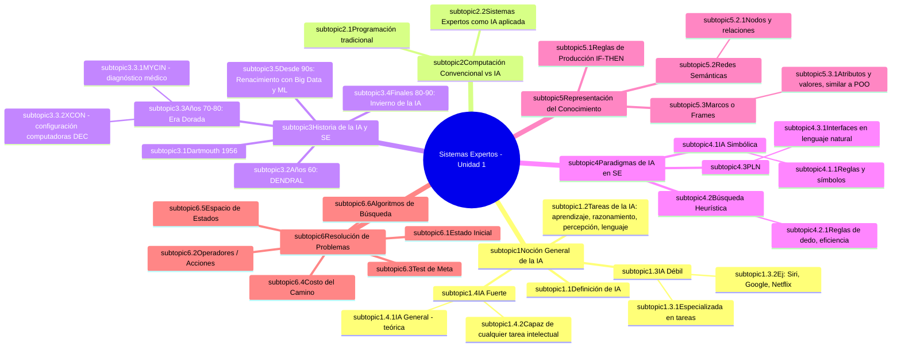

```mermaid
mindmap
  root((Sistemas Expertos - Unidad 1))

    subtopic1Noción General de la IA
      subtopic1.1Definición de IA
      subtopic1.2Tareas de la IA: aprendizaje, razonamiento, percepción, lenguaje
      subtopic1.3IA Débil
        subtopic1.3.1Especializada en tareas
        subtopic1.3.2Ej: Siri, Google, Netflix
      subtopic1.4IA Fuerte
        subtopic1.4.1IA General - teórica
        subtopic1.4.2Capaz de cualquier tarea intelectual

    subtopic2Computación Convencional vs IA
      subtopic2.1Programación tradicional
      subtopic2.2Sistemas Expertos como IA aplicada
    
    subtopic3Historia de la IA y SE
      subtopic3.1Dartmouth 1956
      subtopic3.2Años 60: DENDRAL
      subtopic3.3Años 70-80: Era Dorada
        subtopic3.3.1MYCIN - diagnóstico médico
        subtopic3.3.2XCON - configuración computadoras DEC
      subtopic3.4Finales 80-90: Invierno de la IA
      subtopic3.5Desde 90s: Renacimiento con Big Data y ML

    subtopic4Paradigmas de IA en SE
      subtopic4.1IA Simbólica
        subtopic4.1.1Reglas y símbolos
      subtopic4.2Búsqueda Heurística
        subtopic4.2.1Reglas de dedo, eficiencia
      subtopic4.3PLN
        subtopic4.3.1Interfaces en lenguaje natural

    subtopic5Representación del Conocimiento
      subtopic5.1Reglas de Producción IF-THEN
      subtopic5.2Redes Semánticas
        subtopic5.2.1Nodos y relaciones
      subtopic5.3Marcos o Frames
        subtopic5.3.1Atributos y valores, similar a POO

    subtopic6Resolución de Problemas
      subtopic6.1Estado Inicial
      subtopic6.2Operadores / Acciones
      subtopic6.3Test de Meta
      subtopic6.4Costo del Camino
      subtopic6.5Espacio de Estados
      subtopic6.6Algoritmos de Búsqueda
```