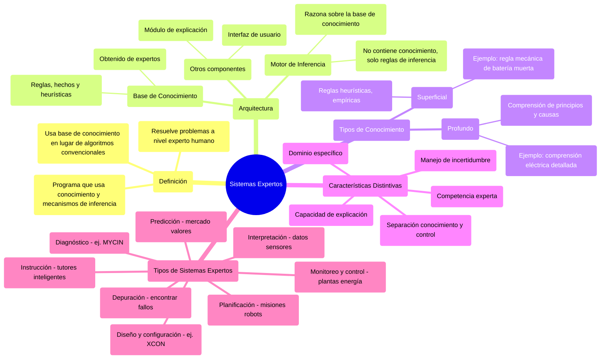

```mermaid
mindmap
  root((Sistemas Expertos))

    subtopic1(Definición)
      subtopic1.1(Programa que usa conocimiento y mecanismos de inferencia)
      subtopic1.2(Resuelve problemas a nivel experto humano)
      subtopic1.3(Usa base de conocimiento en lugar de algoritmos convencionales)

    subtopic2(Arquitectura)
      subtopic2.1(Base de Conocimiento)
        subtopic2.1.1(Reglas, hechos y heurísticas)
        subtopic2.1.2(Obtenido de expertos)
      subtopic2.2(Motor de Inferencia)
        subtopic2.2.1(Razona sobre la base de conocimiento)
        subtopic2.2.2(No contiene conocimiento, solo reglas de inferencia)
      subtopic2.3(Otros componentes)
        subtopic2.3.1(Interfaz de usuario)
        subtopic2.3.2(Módulo de explicación)

    subtopic3(Tipos de Conocimiento)
      subtopic3.1(Superficial)
        subtopic3.1.1(Reglas heurísticas, empíricas)
        subtopic3.1.2(Ejemplo: regla mecánica de batería muerta)
      subtopic3.2(Profundo)
        subtopic3.2.1(Comprensión de principios y causas)
        subtopic3.2.2(Ejemplo: comprensión eléctrica detallada)

    subtopic4(Características Distintivas)
      subtopic4.1(Competencia experta)
      subtopic4.2(Separación conocimiento y control)
      subtopic4.3(Manejo de incertidumbre)
      subtopic4.4(Capacidad de explicación)
      subtopic4.5(Dominio específico)

    subtopic5(Tipos de Sistemas Expertos)
      subtopic5.1(Diagnóstico - ej. MYCIN)
      subtopic5.2(Interpretación - datos sensores)
      subtopic5.3(Predicción - mercado valores)
      subtopic5.4(Diseño y configuración - ej. XCON)
      subtopic5.5(Planificación - misiones robots)
      subtopic5.6(Monitoreo y control - plantas energía)
      subtopic5.7(Depuración - encontrar fallos)
      subtopic5.8(Instrucción - tutores inteligentes)
```