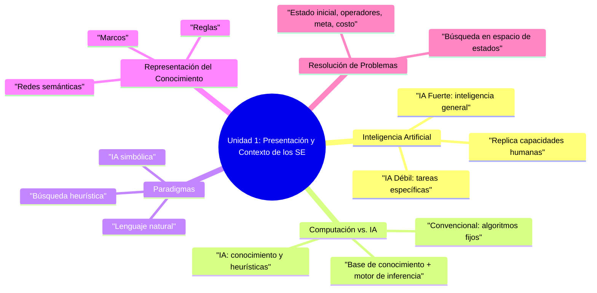

```mermaid
mindmap
  root((Unidad 1: Presentación y Contexto de los SE))

    Inteligencia Artificial
      "Replica capacidades humanas"
      "IA Débil: tareas específicas"
      "IA Fuerte: inteligencia general"

    Computación vs. IA
      "Convencional: algoritmos fijos"
      "IA: conocimiento y heurísticas"
      "Base de conocimiento + motor de inferencia"

    Paradigmas
      "IA simbólica"
      "Búsqueda heurística"
      "Lenguaje natural"

    Representación del Conocimiento
      "Reglas"
      "Redes semánticas"
      "Marcos"

    Resolución de Problemas
      "Estado inicial, operadores, meta, costo"
      "Búsqueda en espacio de estados"

```