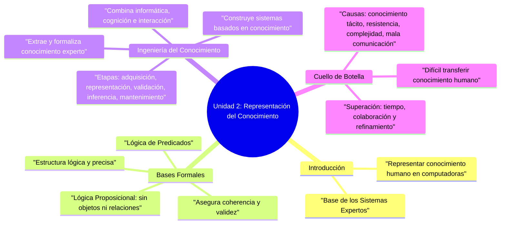

```mermaid
mindmap
  root((Unidad 2: Representación del Conocimiento))

    Introducción
      "Representar conocimiento humano en computadoras"
      "Base de los Sistemas Expertos"

    Bases Formales
      "Estructura lógica y precisa"
      "Lógica Proposicional: sin objetos ni relaciones"
      "Lógica de Predicados"
      "Asegura coherencia y validez"

    Ingeniería del Conocimiento
      "Construye sistemas basados en conocimiento"
      "Combina informática, cognición e interacción"
      "Extrae y formaliza conocimiento experto"
      "Etapas: adquisición, representación, validación, inferencia, mantenimiento"

    Cuello de Botella
      "Difícil transferir conocimiento humano"
      "Causas: conocimiento tácito, resistencia, complejidad, mala comunicación"
      "Superación: tiempo, colaboración y refinamiento"

```