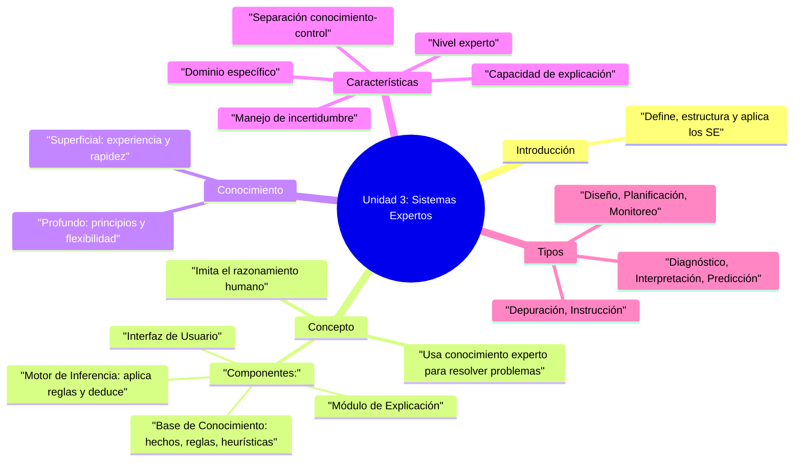

```mermaid
mindmap
  root((Unidad 3: Sistemas Expertos))

    Introducción
      "Define, estructura y aplica los SE"

    Concepto
      "Usa conocimiento experto para resolver problemas"
      "Imita el razonamiento humano"
      "Componentes:"
        "Base de Conocimiento: hechos, reglas, heurísticas"
        "Motor de Inferencia: aplica reglas y deduce"
        "Interfaz de Usuario"
        "Módulo de Explicación"

    Conocimiento
      "Superficial: experiencia y rapidez"
      "Profundo: principios y flexibilidad"

    Características
      "Nivel experto"
      "Separación conocimiento-control"
      "Manejo de incertidumbre"
      "Capacidad de explicación"
      "Dominio específico"

    Tipos
      "Diagnóstico, Interpretación, Predicción"
      "Diseño, Planificación, Monitoreo"
      "Depuración, Instrucción"

```