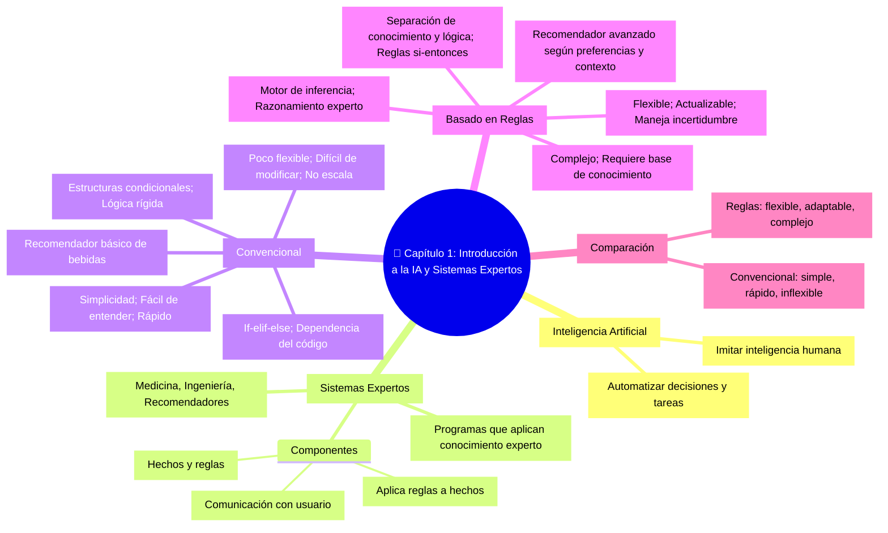

## 🧩 **Capítulo 1 – Introducción a la IA y Sistemas Expertos**

```mermaid
mindmap
  root((🧠 Capítulo 1: Introducción a la IA y Sistemas Expertos))
    
    Definicion_IA[Inteligencia Artificial]
      Concepto[Imitar inteligencia humana]
      Objetivo[Automatizar decisiones y tareas]
      
    Sistemas_Expertos[Sistemas Expertos]
      Definicion[Programas que aplican conocimiento experto]
      Componentes
        Base_Conocimiento[Hechos y reglas]
        Motor_Inferencia[Aplica reglas a hechos]
        Interfaz[Comunicación con usuario]
      Aplicaciones[Medicina, Ingeniería, Recomendadores]
      
    Enfoque_Convencional[Convencional]
      Que_es[Estructuras condicionales; Lógica rígida]
      Caracteristica[If-elif-else; Dependencia del código]
      Ventajas[Simplicidad; Fácil de entender; Rápido]
      Desventajas[Poco flexible; Difícil de modificar; No escala]
      Ejemplo[Recomendador básico de bebidas]
      
    Enfoque_Basado_en_Reglas[Basado en Reglas]
      Que_es[Separación de conocimiento y lógica; Reglas si-entonces]
      Caracteristica[Motor de inferencia; Razonamiento experto]
      Ventajas[Flexible; Actualizable; Maneja incertidumbre]
      Desventajas[Complejo; Requiere base de conocimiento]
      Ejemplo[Recomendador avanzado según preferencias y contexto]
      
    Comparacion[Comparación]
      Tabla[Convencional: simple, rápido, inflexible]
      [Reglas: flexible, adaptable, complejo]
      
```