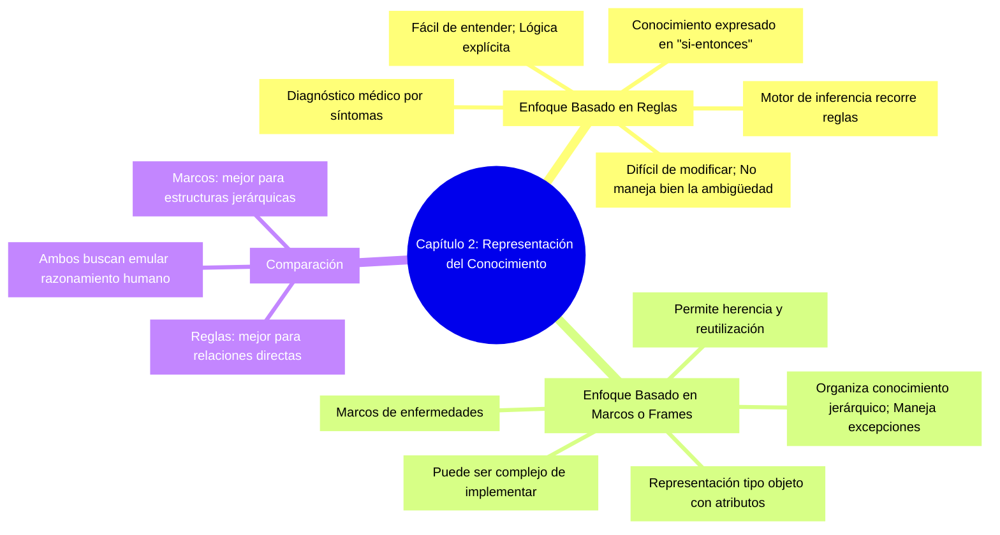

## ⚙️ **Capítulo 2 – Representación del Conocimiento**

```mermaid
mindmap
  root((Capítulo 2: Representación del Conocimiento))

    Reglas[Enfoque Basado en Reglas]
      Que_es[Conocimiento expresado en "si-entonces"]
      Caracteristica[Motor de inferencia recorre reglas]
      Ventajas[Fácil de entender; Lógica explícita]
      Desventajas[Difícil de modificar; No maneja bien la ambigüedad]
      Ejemplo[Diagnóstico médico por síntomas]
      
    Marcos[Enfoque Basado en Marcos o Frames]
      Que_es[Representación tipo objeto con atributos]
      Caracteristica[Permite herencia y reutilización]
      Ventajas[Organiza conocimiento jerárquico; Maneja excepciones]
      Desventajas[Puede ser complejo de implementar]
      Ejemplo[Marcos de enfermedades]
      
    Comparacion[Comparación]
      Reglas_Comparacion[Reglas: mejor para relaciones directas]
      Marcos_Comparacion[Marcos: mejor para estructuras jerárquicas]
      Ambos[Ambos buscan emular razonamiento humano]


```