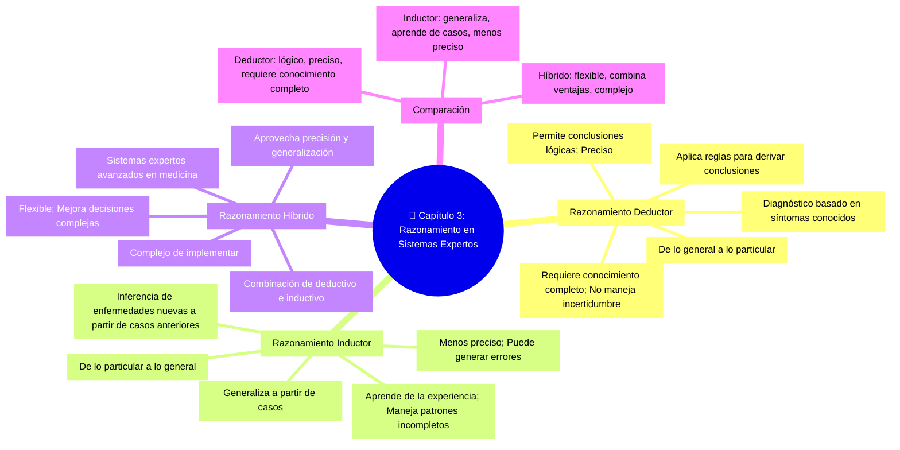

## 🤖 **Capítulo 3 – Métodos de Razonamiento**

```mermaid
mindmap
  root((🧠 Capítulo 3: Razonamiento en Sistemas Expertos))
    
    Razonamiento_Deductor[Razonamiento Deductor]
      Que_es[De lo general a lo particular]
      Caracteristica[Aplica reglas para derivar conclusiones]
      Ventajas[Permite conclusiones lógicas; Preciso]
      Desventajas[Requiere conocimiento completo; No maneja incertidumbre]
      Ejemplo[Diagnóstico basado en síntomas conocidos]
      
    Razonamiento_Inductor[Razonamiento Inductor]
      Que_es[De lo particular a lo general]
      Caracteristica[Generaliza a partir de casos]
      Ventajas[Aprende de la experiencia; Maneja patrones incompletos]
      Desventajas[Menos preciso; Puede generar errores]
      Ejemplo[Inferencia de enfermedades nuevas a partir de casos anteriores]
      
    Razonamiento_Hibrido[Razonamiento Híbrido]
      Que_es[Combinación de deductivo e inductivo]
      Caracteristica[Aprovecha precisión y generalización]
      Ventajas[Flexible; Mejora decisiones complejas]
      Desventajas[Complejo de implementar]
      Ejemplo[Sistemas expertos avanzados en medicina]
      
    Comparacion[Comparación]
      Deductor[Deductor: lógico, preciso, requiere conocimiento completo]
      Inductor[Inductor: generaliza, aprende de casos, menos preciso]
      Hibrido[Híbrido: flexible, combina ventajas, complejo]


```