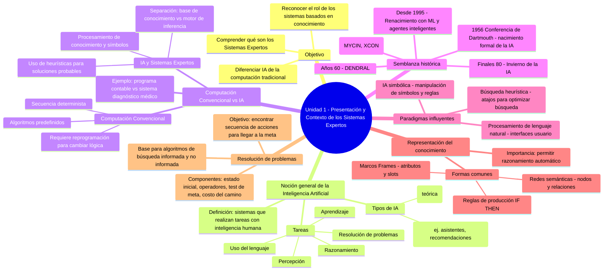

# 🧠 Unidad 1 - Presentación y Contexto de los Sistemas Expertos

```mermaid
mindmap
  root((Unidad 1 - Presentación y Contexto de los Sistemas Expertos))
    Objetivo
      Comprender qué son los Sistemas Expertos
      Diferenciar IA de la computación tradicional
      Reconocer el rol de los sistemas basados en conocimiento
    Noción general de la Inteligencia Artificial
      Definición: sistemas que realizan tareas con inteligencia humana
      Tareas
        Aprendizaje
        Razonamiento
        Resolución de problemas
        Percepción
        Uso del lenguaje
      Tipos de IA
        IA débil o estrecha - especializadas (ej. asistentes, recomendaciones)
        IA fuerte o general - capacidad humana amplia (teórica)
    Computación Convencional vs IA
      Computación Convencional
        Algoritmos predefinidos
        Secuencia determinista
        Requiere reprogramación para cambiar lógica
      IA y Sistemas Expertos
        Procesamiento de conocimiento y símbolos
        Uso de heurísticas para soluciones probables
        Separación: base de conocimiento vs motor de inferencia
      Ejemplo: programa contable vs sistema diagnóstico médico
    Semblanza histórica
      1956 Conferencia de Dartmouth - nacimiento formal de la IA
      Años 60 - DENDRAL
      Años 70-80 - Era dorada (MYCIN, XCON)
      Finales 80 - Invierno de la IA
      Desde 1995 - Renacimiento con ML y agentes inteligentes
    Paradigmas influyentes
      IA simbólica - manipulación de símbolos y reglas
      Búsqueda heurística - atajos para optimizar búsqueda
      Procesamiento de lenguaje natural - interfaces usuario
    Representación del conocimiento
      Importancia: permitir razonamiento automático
      Formas comunes
        Reglas de producción IF THEN
        Redes semánticas - nodos y relaciones
        Marcos Frames - atributos y slots
    Resolución de problemas
      Componentes: estado inicial, operadores, test de meta, costo del camino
      Objetivo: encontrar secuencia de acciones para llegar a la meta
      Base para algoritmos de búsqueda informada y no informada
```