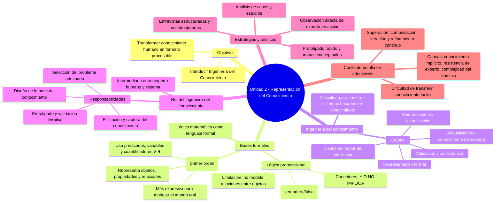

# ⚙️ Unidad 2 - Representación del Conocimiento

```mermaid
mindmap
  root((Unidad 2 - Representación del Conocimiento))
    Objetivo
      Transformar conocimiento humano en formato procesable
      Introducir Ingeniería del Conocimiento
    Bases formales
      Lógica matemática como lenguaje formal
      Lógica proposicional
        Proposiciones binarias (verdadero/falso)
        Conectores: Y O NO IMPLICA
        Limitación: no modela relaciones entre objetos
      Lógica de predicados (primer orden)
        Representa objetos, propiedades y relaciones
        Usa predicados, variables y cuantificadores ∀ ∃
        Más expresiva para modelar el mundo real
    Ingeniería del conocimiento
      Disciplina para construir sistemas basados en conocimiento
      Etapas
        Adquisición de conocimiento del experto
        Representación formal
        Validación y consistencia
        Diseño del motor de inferencia
        Mantenimiento y actualización
    Rol del ingeniero del conocimiento
      Intermediario entre experto humano y sistema
      Responsabilidades
        Selección del problema adecuado
        Elicitación y captura del conocimiento
        Diseño de la base de conocimiento
        Prototipado y validación iterativa
    Estrategias y técnicas
      Entrevistas estructuradas y no estructuradas
      Análisis de casos y estudios
      Observación directa del experto en acción
      Prototipado rápido y mapas conceptuales
    Cuello de botella en adquisición
      Dificultad de transferir conocimiento tácito
      Causas: conocimiento implícito, resistencia del experto, complejidad del dominio
      Superación: comunicación, iteración y refinamiento continuo
```
