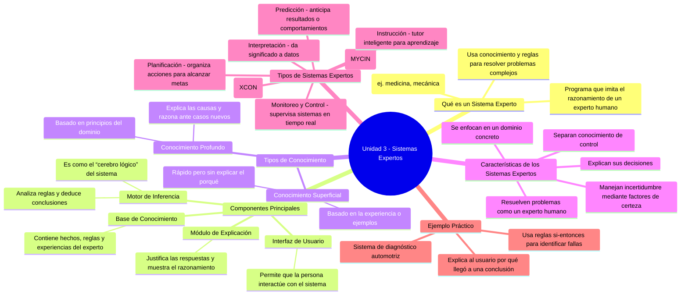

# 🤖 Unidad 3 - Sistemas Expertos: Definición y Conceptos

```mermaid
mindmap
  root((Unidad 3 - Sistemas Expertos))
    Qué es un Sistema Experto
      Programa que imita el razonamiento de un experto humano
      Usa conocimiento y reglas para resolver problemas complejos
      Se aplica a un dominio específico (ej. medicina, mecánica)
    Componentes Principales
      Base de Conocimiento
        Contiene hechos, reglas y experiencias del experto
      Motor de Inferencia
        Analiza reglas y deduce conclusiones
        Es como el “cerebro lógico” del sistema
      Interfaz de Usuario
        Permite que la persona interactúe con el sistema
      Módulo de Explicación
        Justifica las respuestas y muestra el razonamiento
    Tipos de Conocimiento
      Conocimiento Superficial
        Basado en la experiencia o ejemplos
        Rápido pero sin explicar el porqué
      Conocimiento Profundo
        Basado en principios del dominio
        Explica las causas y razona ante casos nuevos
    Características de los Sistemas Expertos
      Resuelven problemas como un experto humano
      Separan conocimiento de control
      Manejan incertidumbre mediante factores de certeza
      Explican sus decisiones
      Se enfocan en un dominio concreto
    Tipos de Sistemas Expertos
      Diagnóstico - identifica causas de fallos (MYCIN)
      Interpretación - da significado a datos
      Predicción - anticipa resultados o comportamientos
      Diseño y Configuración - crea soluciones complejas (XCON)
      Planificación - organiza acciones para alcanzar metas
      Monitoreo y Control - supervisa sistemas en tiempo real
      Instrucción - tutor inteligente para aprendizaje
    Ejemplo Práctico
      Sistema de diagnóstico automotriz
      Usa reglas si-entonces para identificar fallas
      Explica al usuario por qué llegó a una conclusión
```
