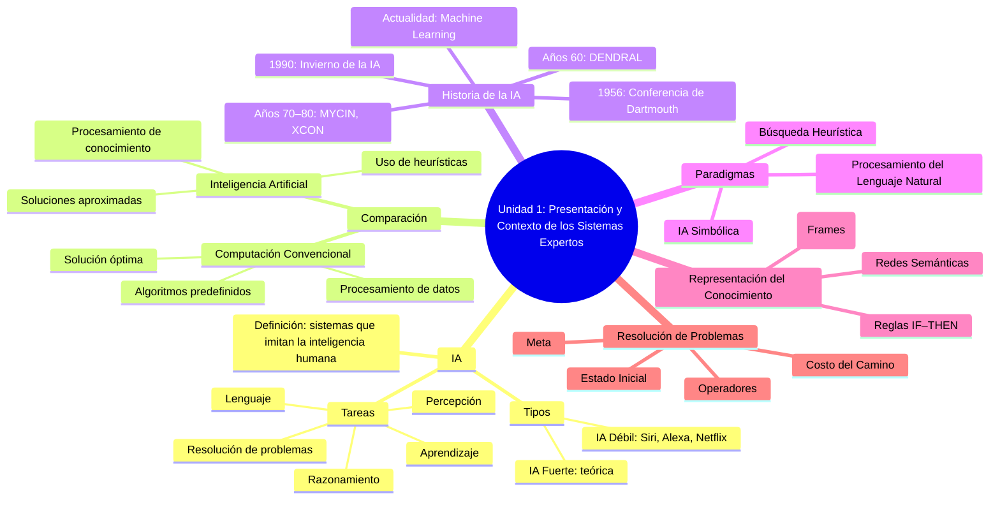

# 🧠 Unidad 1: Presentación y Contexto de los Sistemas Expertos

```mermaid
mindmap
  root((Unidad 1: Presentación y Contexto de los Sistemas Expertos))
    IA
      Definición: sistemas que imitan la inteligencia humana
      Tareas
        Aprendizaje
        Razonamiento
        Resolución de problemas
        Percepción
        Lenguaje
      Tipos
        IA Débil: Siri, Alexa, Netflix
        IA Fuerte: teórica
    Comparación
      Computación Convencional
        Procesamiento de datos
        Algoritmos predefinidos
        Solución óptima
      Inteligencia Artificial
        Procesamiento de conocimiento
        Uso de heurísticas
        Soluciones aproximadas
    Historia de la IA
      1956: Conferencia de Dartmouth
      Años 60: DENDRAL
      Años 70–80: MYCIN, XCON
      1990: Invierno de la IA
      Actualidad: Machine Learning
    Paradigmas
      IA Simbólica
      Búsqueda Heurística
      Procesamiento del Lenguaje Natural
    Representación del Conocimiento
      Reglas IF–THEN
      Redes Semánticas
      Marcos (Frames)
    Resolución de Problemas
      Estado Inicial
      Operadores
      Meta
      Costo del Camino
```
...........................................
