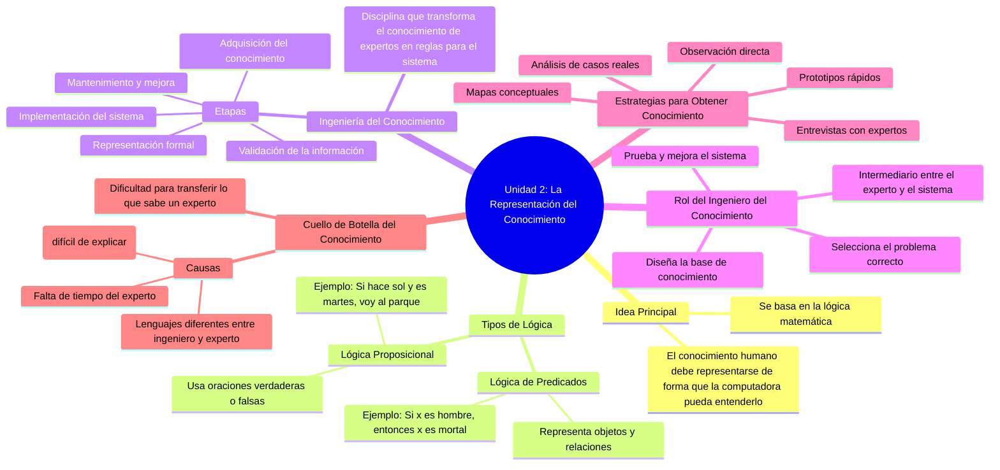

# 🧩 Unidad 2: La Representación del Conocimiento

```mermaid
mindmap
  root((Unidad 2: La Representación del Conocimiento))
    Idea Principal
      El conocimiento humano debe representarse de forma que la computadora pueda entenderlo
      Se basa en la lógica matemática
    Tipos de Lógica
      Lógica Proposicional
        Usa oraciones verdaderas o falsas
        Ejemplo: Si hace sol y es martes, voy al parque
      Lógica de Predicados
        Representa objetos y relaciones
        Ejemplo: Si x es hombre, entonces x es mortal
    Ingeniería del Conocimiento
      Disciplina que transforma el conocimiento de expertos en reglas para el sistema
      Etapas
        Adquisición del conocimiento
        Representación formal
        Validación de la información
        Implementación del sistema
        Mantenimiento y mejora
    Rol del Ingeniero del Conocimiento
      Intermediario entre el experto y el sistema
      Selecciona el problema correcto
      Diseña la base de conocimiento
      Prueba y mejora el sistema
    Estrategias para Obtener Conocimiento
      Entrevistas con expertos
      Observación directa
      Análisis de casos reales
      Prototipos rápidos
      Mapas conceptuales
    Cuello de Botella del Conocimiento
      Dificultad para transferir lo que sabe un experto
      Causas
        Conocimiento tácito (difícil de explicar)
        Falta de tiempo del experto
        Lenguajes diferentes entre ingeniero y experto
```