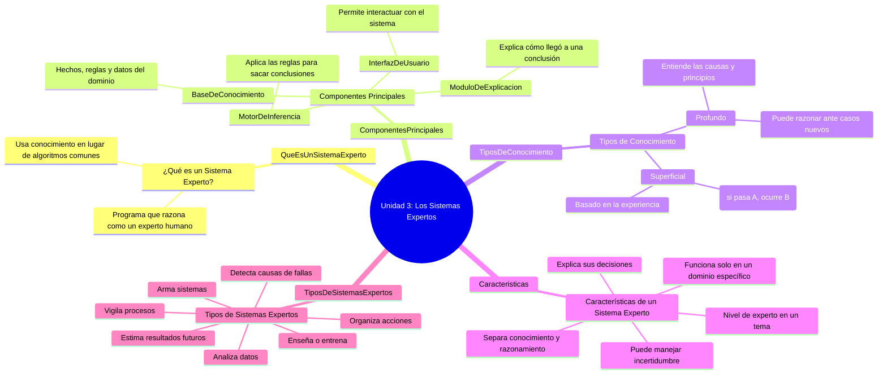

# 🧩 Unidad 3: La Representación del Conocimiento

```mermaid
mindmap
  root((Unidad 3: Los Sistemas Expertos))
    QueEsUnSistemaExperto
      ¿Qué es un Sistema Experto?
        Programa que razona como un experto humano
        Usa conocimiento en lugar de algoritmos comunes
    ComponentesPrincipales
      Componentes Principales
        BaseDeConocimiento
          Hechos, reglas y datos del dominio
        MotorDeInferencia
          Aplica las reglas para sacar conclusiones
        InterfazDeUsuario
          Permite interactuar con el sistema
        ModuloDeExplicacion
          Explica cómo llegó a una conclusión
    TiposDeConocimiento
      Tipos de Conocimiento
        Superficial
          Basado en la experiencia
          (si pasa A, ocurre B)
        Profundo
          Entiende las causas y principios
          Puede razonar ante casos nuevos
    Caracteristicas
      Características de un Sistema Experto
        Nivel de experto en un tema
        Separa conocimiento y razonamiento
        Puede manejar incertidumbre
        Explica sus decisiones
        Funciona solo en un dominio específico
    TiposDeSistemasExpertos
      Tipos de Sistemas Expertos
        Detecta causas de fallas
        Analiza datos
        Estima resultados futuros
        Arma sistemas
        Organiza acciones
        Vigila procesos
        Enseña o entrena
```