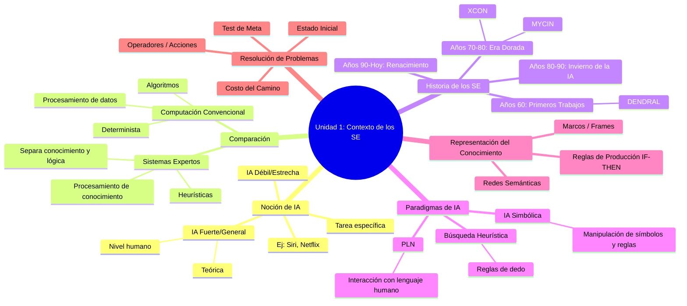

# Mapa Mental: Unidad 1 - Contexto de los SE

```mermaid
mindmap
  root((Unidad 1: Contexto de los SE))

    Noción de IA
      IA Débil/Estrecha
      Tarea específica
      Ej: Siri, Netflix
      IA Fuerte/General
        Nivel humano
        Teórica
    Comparación
      Computación Convencional
        Procesamiento de datos
        Algoritmos
        Determinista
      Sistemas Expertos
        Procesamiento de conocimiento
        Heurísticas
        Separa conocimiento y lógica
    Historia de los SE
      Años 60: Primeros Trabajos
        DENDRAL
      Años 70-80: Era Dorada
        MYCIN
        XCON
      Años 80-90: Invierno de la IA
      Años 90-Hoy: Renacimiento
    Paradigmas de IA
      IA Simbólica
        Manipulación de símbolos y reglas
      Búsqueda Heurística
        Reglas de dedo
      PLN
        Interacción con lenguaje humano
    Representación del Conocimiento
      Reglas de Producción IF-THEN
      Redes Semánticas
      Marcos / Frames
    Resolución de Problemas
      Estado Inicial
      Operadores / Acciones
      Test de Meta
      Costo del Camino

```