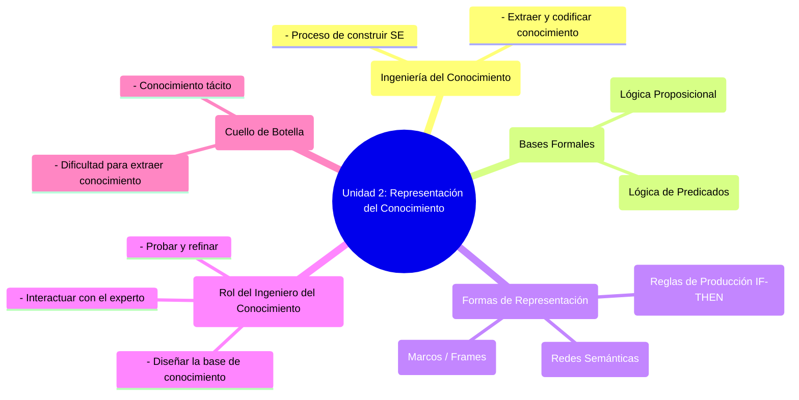

# Mapa Mental: Unidad 2

```mermaid
mindmap
  root((Unidad 2: Representación del Conocimiento))
    (Ingeniería del Conocimiento)
      ::icon(fa fa-cogs)
      - Proceso de construir SE
      - Extraer y codificar conocimiento
    (Bases Formales)
      ::icon(fa fa-superscript)
      (Lógica Proposicional)
      (Lógica de Predicados)
    (Formas de Representación)
      ::icon(fa fa-project-diagram)
      (Reglas de Producción IF-THEN)
      (Redes Semánticas)
      (Marcos / Frames)
    (Rol del Ingeniero del Conocimiento)
      ::icon(fa fa-user-tie)
      - Interactuar con el experto
      - Diseñar la base de conocimiento
      - Probar y refinar
    (Cuello de Botella)
      ::icon(fa fa-bottle-water)
      - Dificultad para extraer conocimiento
      - Conocimiento tácito

```