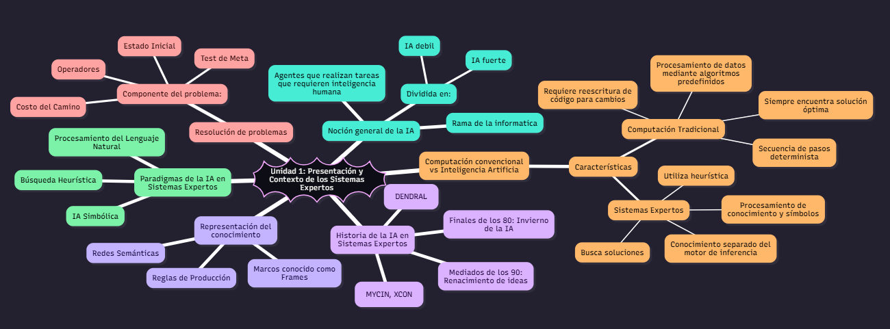

# UNIDAD 1:
## Codigo para ejecutar en mermaidchart
```bash
---
config:
  theme: redux-dark-color
---
mindmap
))Unidad 1: Presentación y Contexto de los Sistemas Expertos((
  Noción general de la IA
    Rama de la informatica
    Agentes que realizan tareas que requieren inteligencia humana
    Dividida en:
      IA debil
      IA fuerte
  Computación convencional vs Inteligencia Artificia
    Características
      Computación Tradicional
        Procesamiento de datos mediante algoritmos predefinidos
        Secuencia de pasos determinista
        Requiere reescritura de código para cambios
        Siempre encuentra solución óptima
      Sistemas Expertos
        Procesamiento de conocimiento y símbolos
        Utiliza heurística
        Conocimiento separado del motor de inferencia
        Busca soluciones
  Historia de la IA en Sistemas Expertos
    Años 60: Primeros trabajos (DENDRAL)
    Años 70 y 80: Era dorada (MYCIN, XCON)
    Finales de los 80: Invierno de la IA
    Mediados de los 90: Renacimiento de ideas
  Paradigmas de la IA en Sistemas Expertos
    IA Simbólica
    Búsqueda Heurística
    Procesamiento del Lenguaje Natural
  Representación del conocimiento
    Reglas de Producción
    Redes Semánticas
    Marcos conocido como Frames
  Resolución de problemas
    Componente del problema:
      Estado Inicial
      Operadores
      Test de Meta
      Costo del Camino

```
## Visualizar
