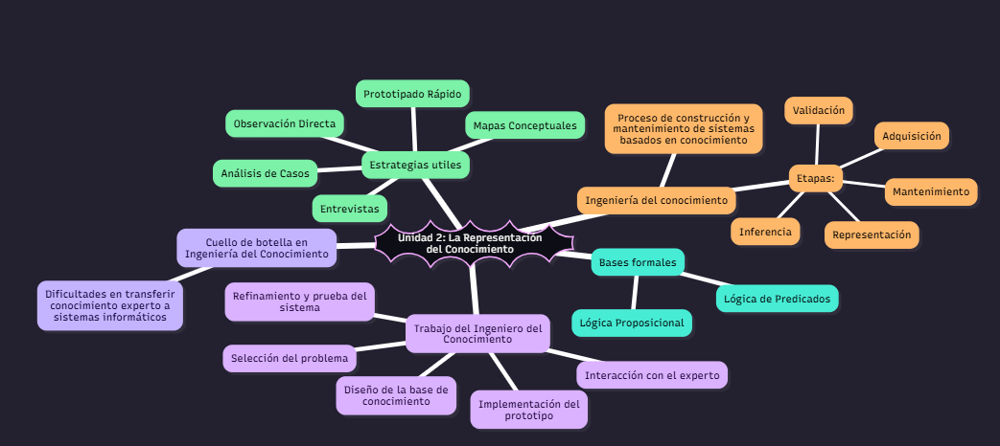

# UNIDAD 2:
## Codigo para ejecutar en mermaidchart
```bash
---
config:
  theme: redux-dark-color
---
mindmap
))Unidad 2: La Representación del Conocimiento((
  Bases formales
    Lógica Proposicional
    Lógica de Predicados

  Ingeniería del conocimiento
    Proceso de construcción y mantenimiento de sistemas basados en conocimiento
    Etapas:
        Adquisición
        Representación
        Validación
        Inferencia
        Mantenimiento 
  Trabajo del Ingeniero del Conocimiento
    Selección del problema
    Interacción con el experto
    Diseño de la base de conocimiento
    Implementación del prototipo
    Refinamiento y prueba del sistema
  Estrategias utiles
    Entrevistas
    Análisis de Casos
    Observación Directa
    Prototipado Rápido
    Mapas Conceptuales  
  Cuello de botella en Ingeniería del Conocimiento
    Dificultades en transferir conocimiento experto a sistemas informáticos
```
## Visualizar
