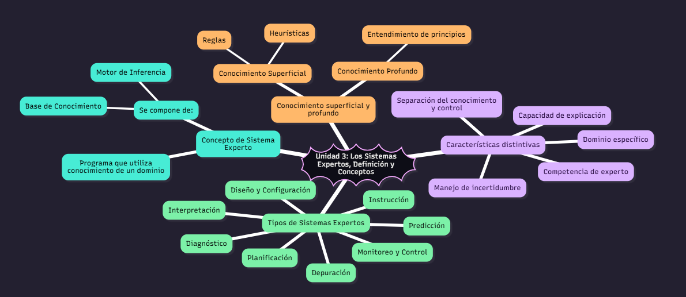

# UNIDAD 3:
## Codigo para ejecutar en mermaidchart
```bash
---
config:
  theme: redux-dark-color
---
mindmap
))Unidad 3: Los Sistemas Expertos, Definición y Conceptos((
  Concepto de Sistema Experto
    Programa que utiliza conocimiento de un dominio
    Se compone de:
        Base de Conocimiento
        Motor de Inferencia

  Conocimiento superficial y profundo
    Conocimiento Superficial
        Heurísticas
        Reglas
    Conocimiento Profundo
        Entendimiento de principios 
  Características distintivas
    Competencia de experto
    Separación del conocimiento y control
    Manejo de incertidumbre
    Capacidad de explicación
    Dominio específico
  Tipos de Sistemas Expertos
    Diagnóstico
    Interpretación
    Predicción
    Diseño y Configuración
    Planificación
    Monitoreo y Control
    Depuración
    Instrucción
```
## Visualizar

